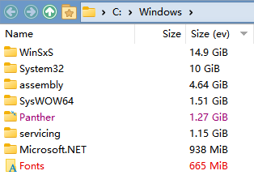

# IbDOpusExt
Languages: [English](README.md), [简体中文](README.zh-Hans.md)  
An extension for [Directory Opus](https://www.gpsoft.com.au/).

## Features
* File Display Modes
  * Thumbnails
    * `#Set MaxThumbSize` command  
      Dynamically modify the max size of thumbnails.  
      e.g. `#Set MaxThumbSize = 512`
* File Operations
  * Logging
    * Configure maximum item number of undo log
* Folders
  * Folder Behaviour
    * Size column via Everything  
      Display folder sizes instantly with voidtool's [Everything](https://www.voidtools.com/):  
      
* Viewer
  * Plugins
    * Fix dependency loading bug for plugins
* Zip & Other Archives
  * Archive and VFS Plugins
    * Fix dependency loading bug for plugins

## Requirements
* Windows 10 or later
* Directory Opus v12.23 x64
* [.NET 6 Runtime](https://dotnet.microsoft.com/download/dotnet/thank-you/runtime-desktop-6.0.6-windows-x64-installer)
* [VC++ 2022 x64 Runtime](https://aka.ms/vs/17/release/vc_redist.x64.exe)

## Installation
1. Download release package from [Releases](../../releases).
2. Extract the package and put the files into `C:\Program Files\GPSoftware\Directory Opus` .
3. Open DOpus, go Settings→Preferences→Viewer→Plugins, check IbDOpusExt, click the Apply button.