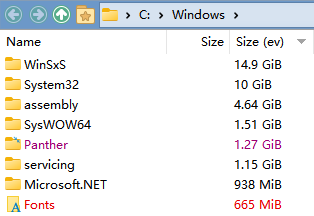

# IbDOpusExt
语言: [English](README.md), [简体中文](README.zh-Hans.md)  
一个 [Directory Opus](https://www.gpsoft.com.au/) 的扩展。

## 功能
* 文件显示模式
  * 缩略图
    * `#Set MaxThumbSize` 命令  
      动态修改缩略图的最大尺寸。  
      例如：`#Set MaxThumbSize = 512`
* 文件操作
  * 日志
    * 配置撤销记录的最大数量
* 文件夹
  * 文件夹行为
    * Everything 尺寸列  
      通过 voidtool 的 [Everything](https://www.voidtools.com/) 即时显示文件夹尺寸：  
      
* 查看器
  * 插件
    * 修复插件依赖加载问题
* 压缩包
  * 压缩包和 VFS 插件
    * 修复插件依赖加载问题

## 安装要求
* Windows 10 及以上
* Directory Opus v12.23 x64
* [.NET 6 运行时](https://dotnet.microsoft.com/download/dotnet/thank-you/runtime-desktop-6.0.6-windows-x64-installer)
* [VC++ 2022 x64 运行时](https://aka.ms/vs/17/release/vc_redist.x64.exe)

## 安装
1. 从 [Releases](../../releases) 下载压缩包。
2. 解压压缩包，把文件替换进 `C:\Program Files\GPSoftware\Directory Opus` 。
3. 打开 DOpus，进入 设置→配置→查看器→插件，勾选 IbDOpusExt，点击“应用”按钮。